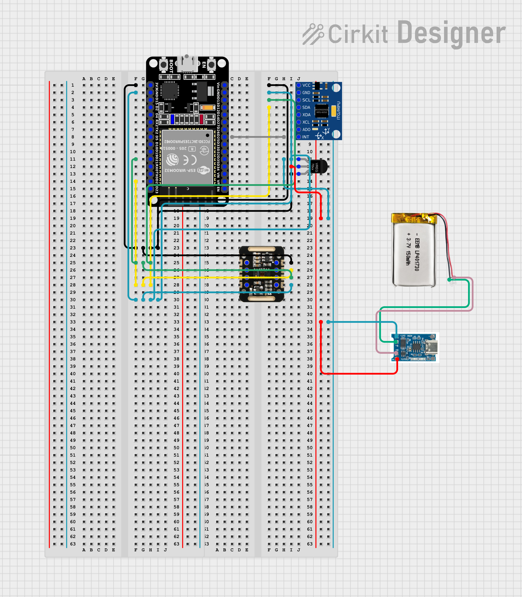

# Sleep Monitor

ESP32 wearable that tracks heart rate (MAX30102), motion and temperature (MPU6050) overnight and streams them over BLE at 1 Hz.



## Firmware

```sh
pio run -t upload && pio device monitor
```

## Dashboard

```sh
pip install bleak matplotlib
python src/dashboard/dashboard.py
```

Set `DEVICE_ADDRESS` in `dashboard.py` to your board's address, or `DEBUG_FAKE_DATA = True` to run without hardware.

## Docs

- [Power management](docs/power-management.md)

## License

MIT
