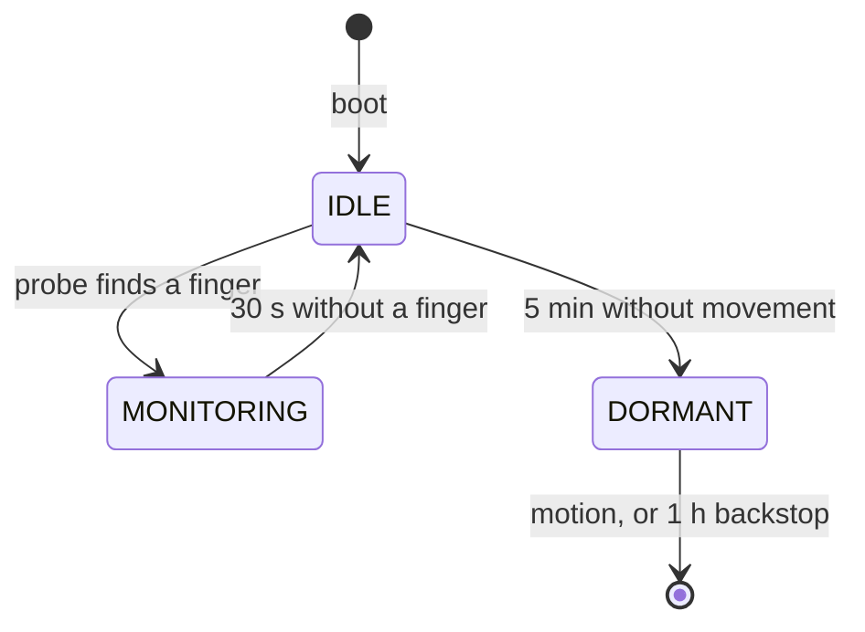

# Power management

The monitor is worn for a night and set down for the rest of the day, so nearly all of the energy it
wastes is wasted while nobody is wearing it.

`PowerManager` decides how much of the device should be running, `BioMonitor` applies the decision.

## States

| State | PPG | IMU | BLE | ESP32 | Draw |
|---|---|---|---|---|---|
| MONITORING | 50 Hz | accel only, gyro in standby | advertising, notifying 1 Hz | running | ~47 mA |
| IDLE | 5 samples every 2 s | accel only, gyro in standby | advertising, notifying 1 Hz | running | ~45 mA |
| DORMANT | shut down | accel-only low power, WOM armed | stack released | deep sleep | ~40 µA |

DORMANT does not transition anywhere. The device leaves it through deep sleep, which ends in a reset,
so the next thing that runs is `setup()` and the machine restarts at IDLE with nothing carried over.

### What each state is for

**MONITORING** is the device doing its job, and nothing here tries to make it cheaper. See
[Not done](#not-done).

**IDLE** saves almost nothing on its own — about 2 mA of 50, since the CPU and radio are what dominate
and both keep running. Its real job is to be the place where stillness is measured, and to keep the
device connectable while a wearer is likely to still be holding it. Treat it as a waiting room for
DORMANT rather than as a low power state.

**DORMANT** is where the saving is: roughly three orders of magnitude, which is what turns a device
that lasts a day into one that lasts weeks between charges.

## Constants

### `NO_FINGER_TIMEOUT_MS` = 30 s

How long the infrared signal may stay below the PPG's finger threshold before the device is taken to
be off the wearer.

*Lower bound.* A clip or strap shifting while the wearer rolls over breaks skin contact for a moment.
Shutting the PPG down for that costs more than it saves: `MAX30102Driver::wake()` rearms beat timing,
so the next two beats go on re-establishing an interval — roughly two seconds of dead time to save a
fraction of one.

*Upper bound.* Without measurements the filter coasts on its model, and the velocity term decays by
`VELOCITY_DECAY` = 0.96 per 20 ms sample: a time constant of −0.02/ln(0.96) = 0.49 s. Five of those,
about 2.5 s, and the velocity is spent and the estimate is a flat held number. Past that point the
filter is reporting a heart rate it has no evidence for, so waiting longer protects nothing.

30 s sits an order of magnitude above the transients and an order of magnitude past the point where
the estimate stops meaning anything. At the 1 Hz notify rate it also gives a watching dashboard thirty
frames of held value before the device goes quiet, which reads as a removal rather than a dropout.

### `STILL_TIMEOUT_MS` = 5 min

How long the device must sit still, already off the wearer, before it powers down.

This does not have to outlast the gap between one wearing and the next, only the pauses inside a
single handling session — putting the device on is itself movement, and any movement restarts the
window. Someone who takes it off, sets it down, picks it back up and puts it on again resets it
several times over.

It costs one full-power stretch per removal: 5 min at ~50 mA is 4.2 mAh, under 1% of a 500 mAh cell.
It buys the other fifteen and a half hours of a day off the wrist, which at the same 50 mA would be
about 800 mAh — more than such a cell holds. Cutting the window to one minute would recover another
3.4 mAh a day, four tenths of one percent, in exchange for a device that powers down while its wearer
is still deciding whether to put it on.

### `PROBE_WINDOW_SAMPLES` = 5, `PROBE_INTERVAL_MS` = 2 s

IDLE keeps the PPG shut down apart from a short probe.

The window is counted in samples rather than milliseconds because the read blocks until the sensor
produces one: the PPG has just been woken, and how long its first sample takes to arrive is the
sensor's business, not something a wall clock should cut short. At the 50 Hz tick, five samples is
about 100 ms.

Five is enough because `MAX30102Driver::wake()` discards whatever the FIFO held from before the
shutdown, so all five are captured after the LEDs come back. The first covers the LED driver settling
and the 4-sample averager filling; the rest are ordinary readings. Only the infrared level is taken
from them — a threshold comparison against skin reflectance, not something needing the beat detector
to have converged.

The interval is the delay between the device being put on and sampling resuming, and it disappears
into the delay that follows it: the rate detector needs two beats to measure an interval, about two
seconds at a resting rate, before it can report anything at all.

Together they hold the PPG at five samples in 2000 ms — near enough a 5% duty cycle, turning the
~2 mA its LEDs draw into about 100 µA averaged over IDLE.

### `DORMANT_WOM_THRESHOLD` = 40 counts (160 mg)

The worn threshold (`WORN_WOM_THRESHOLD` = 10 counts, 40 mg) is deliberately near the noise floor,
because the movements it exists to catch are the small ones a sleeper makes. A device lying on
furniture needs the opposite. Footsteps, a door closing, and a phone vibrating on the same surface all
put well under 50 mg into it; at 10 counts each of those would boot the device and hold it awake for
the five minutes the stillness window takes to expire, costing more than a night of dormancy saves.

The movement that should end dormancy is a hand picking the device up, which cannot be done in under a
couple of hundred mg. 160 mg is clear of what a surface transmits and well under what handling
produces.

### `DORMANT_LP_ODR` = 5 (7.81 Hz)

The accelerometer's rate in low power mode sets both the current and the worst-case delay between the
device being picked up and the interrupt firing, and the two trade against each other step for step.

128 ms of delay is spent inside the second or so the ESP32 takes to boot, bring BLE up and run its
first probe, so it costs the wearer nothing observable. The ~23 µA it draws to get that is already
three orders of magnitude under what the sleeping chip is saving, so paying twice it for half the
delay would buy nothing either.

### `DORMANT_BACKSTOP_US` = 1 h

Motion is the intended way out of dormancy, and it is the only way out if the IMU stops raising
interrupts — one whose I2C line fails after `begin()` leaves a device that reads as permanently still,
goes dormant, and never hears the movement that would end it.

Waking on a timer regardless bounds that fault to an hour. It is cheap because such a wake goes
straight back to sleep: boot, BLE bring-up and one empty probe come to about a second, so 24 of them a
day is roughly 0.4 mAh against the ~800 mAh dormancy is saving.

## Deep sleep, not light sleep

Two properties of this build rule light sleep out, both checked against the installed SDK:

- `CONFIG_PM_ENABLE is not set` in the prebuilt Arduino SDK, so automatic (tickless) light sleep is
  not available at all.
- `CONFIG_BTDM_CTRL_LPCLK_SEL_MAIN_XTAL=y`, so the Bluetooth controller's low power clock is the main
  crystal — which light sleep powers down. Coexistence would need an external 32 kHz crystal, which
  ESP32-WROOM-32 modules do not carry.

Forced light sleep therefore requires releasing the BLE stack first, and once that is gone light
sleep's advantage over deep sleep is gone with it: what it preserves is RAM this device has nothing to
keep in, at roughly eighty times the current. Deep sleep also gives clean re-initialization for free,
since waking is a reset.

The one thing lost is resume latency — about a second to boot and re-advertise, against the two
seconds the rate detector needs before it can report anything anyway.

## The IMU is the exception

`MPU6050Driver::sleep()` exists and is deliberately never called. It sets the SLEEP bit, which stops
the accelerometer, and the accelerometer is what raises the wake-on-motion interrupt — a sleeping IMU
cannot report the movement that would end dormancy.

This matters more than it sounds. The sensors run from their own supply and keep drawing through an
ESP32 deep sleep, so whatever is left running sets the floor for the whole device rather than the
chip's own current. Leaving the IMU as it runs while awake, accelerometer sampling continuously at
about 450 µA, would have made DORMANT worth about 100× instead of about 1000×.

`enterLowPowerMotion()` is the alternative: the accelerometer-only low power mode from §4.2 of the
MPU6500 register map, which is also the tail of the datasheet's own wake-on-motion procedure. The
gyroscope goes to standby, the temperature sensor is disabled, and the accelerometer is sampled in
bursts at `LP_ACCEL_ODR` instead of continuously — about 23 µA, with the INT pin behaving exactly as
`configureMotionInterrupt()` set it up to.

### Register state outlives a reset

The IMU keeps its own supply and is never reset over I2C, so a boot following a dormant stretch
inherits whatever the previous session left configured, not the power-on defaults. `init()` therefore
writes `PWR_MGMT_1` and `PWR_MGMT_2` unconditionally, and `configureMotionInterrupt()` writes
`ACCEL_CONFIG2`, so that a boot lands in the same state either way.

## Entering dormancy

Order matters, and the sequence in `BioMonitor::enterDormant()` is:

1. **Check the interrupt line first**, before touching anything, so changing our mind is free. `ext0`
   wakes on a *level*, not an edge, and the INT pin latches low until `INT_STATUS` is read. Clearing
   the latch and finding it low anyway means it is being reasserted — the device is moving right now,
   which is the opposite of the condition that got us here. `PowerManager::cancelDormant()` puts the
   machine back in IDLE.
2. **PPG down.** Its LEDs alone are two hundred times the floor the sleeping chip sets.
3. **BLE stack released** — `BLEDriver::shutdown()`, not `sleep()`. Deep sleep powers the radio's
   clocks off underneath the controller, and a controller still running when that happens is not in a
   state anything recovers from. The notification timer has to stop before the stack it notifies
   through goes away.
4. **IMU to low power motion mode**, with the dormant threshold.
5. **Detach the edge handler, clear the latch again**, since reconfiguring the accelerometer can leave
   a comparison pending against a sample taken under the old settings.
6. **Arm `ext0` on the INT pin and the backstop timer**, then sleep.

### The RTC pull-up

The INT pin is push-pull, so it drives itself high when idle and wants no help. The `rtc_gpio_pullup_en()`
call is insurance against an IMU that stops driving it: a floating input reading low is an immediate
wake, and a device that boots, finds nothing and sleeps again on a loop is worse than one that never
sleeps. The pull-up set in `begin()` is a digital-domain one and does not survive into deep sleep, so
it has to be asked for again.

## Waking

Deep sleep ends in a reset, so `esp_sleep_get_wakeup_cause()` in `begin()` is the only record of what
the device was doing beforehand, and it has to be read before anything else clears it.

- **Timer** — the backstop firing on a device nothing has touched. `PowerManager::begin()` seeds the
  stillness window as already spent, so one empty probe sends the device straight back down. Real
  movement during those few hundred milliseconds still restarts it in the ordinary way.
- **ext0 / power-on** — someone has the device in their hand, or a user just switched it on. Both get
  the full window.

## Failure modes and guards

| Fault | Guard |
|---|---|
| IMU fails `init()` — no interrupts, so the device reads as permanently still and would go dormant with no way back | `imuOk` gates DORMANT off entirely; the device stays in IDLE |
| IMU fails *after* `begin()` | 1 h backstop timer bounds it |
| INT pin latched or stuck low | Checked before teardown; the device stays awake rather than boot-looping |
| INT pin floating | RTC pull-up |
| Notify timer fires after the stack is freed | `stopPeriodicNotify()` first, then a 100 ms yield for any in-flight callback; `timerCallback()` also null-checks `pCharacteristic`, which `shutdown()` clears |

One benign case is not guarded: if wake-on-motion trips spuriously on entering cycle mode, the device
wakes immediately, treats it as a motion wake, and spends a full 5 min window before trying again. It
would show up as a device that never stays asleep, not as one that never wakes.

## Reported values

`getFilteredHR()` returns **−1** whenever the device is not in MONITORING. Outside that state the
filter is not being advanced and `x` holds whatever the last wearer left in it; reporting that would
be reporting a heart rate for a device sitting on a table, with no way for a reader to tell it from a
live one. `dashboard.py` already documents −1 as the no-reading sentinel and its regex accepts it.

Motion and temperature keep reporting through IDLE and have no sentinel, since both readings are real
ones either way — though in IDLE the temperature is measuring the room rather than anything near a
body. The heart rate is what says which.

The filter is reset on every entry to MONITORING, not just at construction. An estimate carried across
a gap describes whoever was wearing the device before it, and its covariance says the filter is
confident about it, so the first beats of the next session would be weighed against a stranger's
resting rate and largely dismissed.

## Why a state machine and not a task

`BioMonitor.h` declares the sampling task the sole owner of the I2C bus. A power task of its own would
be the other half of a lock on every sensor access, so `PowerManager` holds no hardware and touches no
bus — the sampling task asks it what to do on each tick and does it. `state()` reads a single word and
is safe to call from the BLE timer task; everything else is confined to the sampling task.

## Not done

- **MONITORING's ~47 mA is the real battery limit** — a 500 mAh cell is roughly one night. CPU
  frequency scaling (240 → 80 MHz, which BLE still supports) is the next meaningful win.
- A **failed PPG `init()`** leaves `processSample()` spending the library's 250 ms FIFO timeout on
  every call, in MONITORING and in each IDLE probe window.
